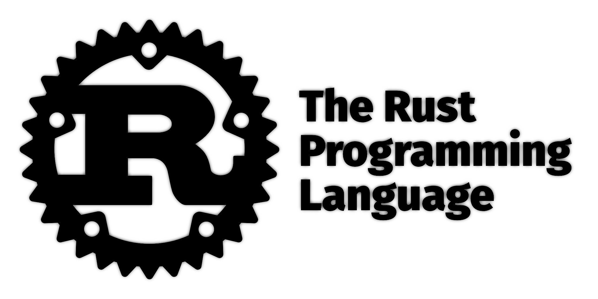

---

This repository documents my experience reading *The Rust Programming Language* (Second Edition). It includes:

- Implementations that extend slightly beyond the book's content with additional concepts not covered in the text.
- Basic experiments to explore Rust's features and performance.
- There are some additional basic implementations beyond the book.

For more information about Rust, visit the official [Rust website](https://www.rust-lang.org/).

---